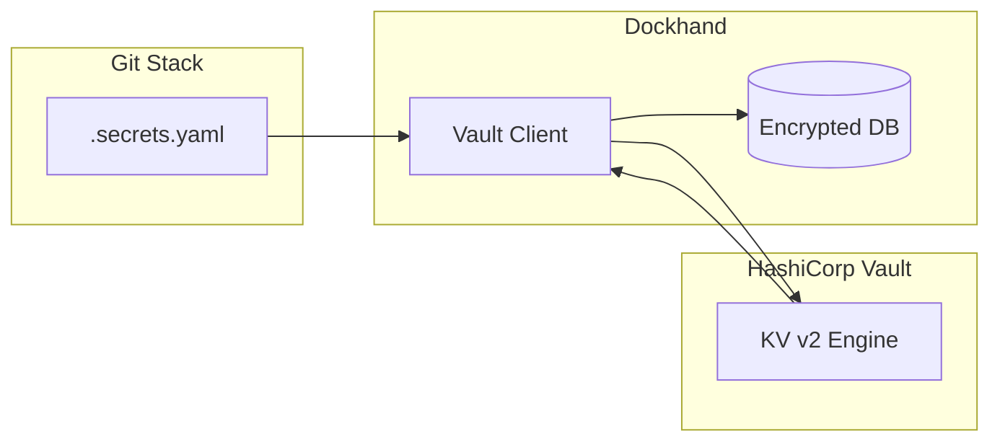
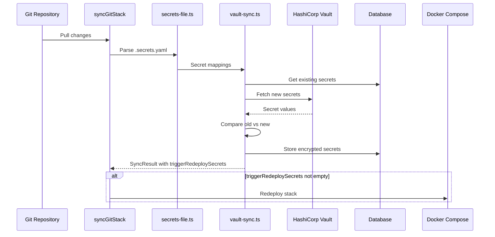
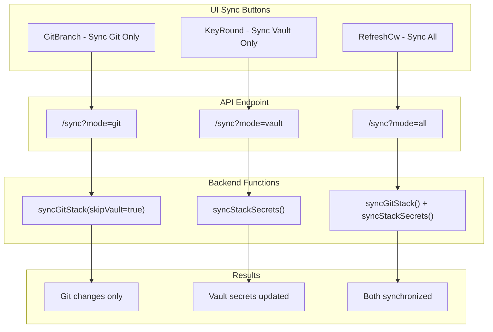
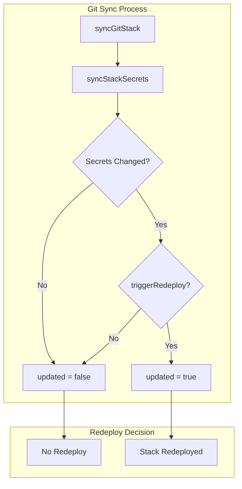

# HashiCorp Vault Integration

This documentation describes the native HashiCorp Vault integration in Dockhand.

## Overview

Dockhand can fetch secrets directly from HashiCorp Vault and store them as encrypted environment variables for Docker stacks. The integration supports:

- **KV v2 Secrets Engine**
- **Authentication**: Token, AppRole, Kubernetes
- **Self-Signed Certificates** (optional)
- **Automatic Sync** on Git Stack deployment
- **Manual Sync** via API
- **Automatic Redeploy** when configured secrets change

## Architecture



### Sync Process Flow



### Sync Mode Options

The sync process can be triggered in three different modes:



## Configuration

### 1. Vault Settings (UI)

Navigate to **Settings → Vault** and configure:

| Field | Description | Example |
|-------|-------------|---------|
| Vault Address | URL of the Vault server | `https://vault.example.com:8200` |
| Namespace | Vault Enterprise Namespace (optional) | `my-namespace` |
| Default Secret Path | Default path for secrets | `kv/data` or `secret/data` |
| Accept Self-Signed Certs | Skip TLS verification | On/Off |

### 2. Authentication

#### Token Auth
- Simplest method
- Token is stored encrypted in the database

#### AppRole Auth
- Recommended for automated systems
- Requires: Role ID + Secret ID

#### Kubernetes Auth
- For Kubernetes deployments
- Uses Service Account Token automatically

## Usage

### .secrets.yaml File

Create a `.secrets.yaml` file in the root directory of your Git stack:

```yaml
# .secrets.yaml

secrets:
  # 1. Simple: Env var name = Vault key name
  - ADMIN_PASSWORD

  # 2. Mapping: Different Vault key name
  - name: DATABASE_URL
    key: db_connection_string

  # 3. Custom path + key
  - name: SHARED_API_KEY
    path: kv/data/shared/api
    key: api_key

# Optional: Stack-wide path (overrides default from settings)
# vault:
#   path: kv/data/myapp
```

### Automatic Redeploy on Secret Changes

You can configure a stack to automatically redeploy when specific Vault secrets change.

#### Redeploy Trigger Flow



#### Configuration Example

```yaml
# .secrets.yaml

vault:
  path: secret/data/myapp
  # Global: All secrets trigger redeploy (default: false)
  triggerRedeploy: false

secrets:
  # This secret does NOT trigger redeploy (uses global default)
  - name: API_KEY
    key: api_key

  # This secret triggers redeploy (overrides global)
  - name: DATABASE_PASSWORD
    key: database_password
    triggerRedeploy: true

  # This secret also triggers redeploy
  - name: ADMIN_TOKEN
    key: admin_token
    triggerRedeploy: true
```

#### Logic

| vault.triggerRedeploy | secret.triggerRedeploy | Result |
|-----------------------|------------------------|--------|
| false (default)       | not set                | No Redeploy |
| false (default)       | true                   | Redeploy |
| false (default)       | false                  | No Redeploy |
| true                  | not set                | Redeploy |
| true                  | false                  | No Redeploy |
| true                  | true                   | Redeploy |

**Note**: A redeploy is only triggered when:
1. The secret value has actually changed (old vs. new value is compared)
2. The secret is configured with `triggerRedeploy: true` (directly or via global default)

### Automatic Sync

Secrets are automatically synchronized when:
- A Git stack is deployed
- A Git stack is updated (git pull)

### Manual Sync

Via the API:
```bash
curl -X POST http://localhost:3000/api/stacks/{stack-name}/secrets/sync
```

### UI Sync Options

For Git stacks, the Stacks page provides three separate sync buttons in the Actions column:

| Icon | Color | Action | Description |
|------|-------|--------|-------------|
| GitBranch | Purple | Sync Git | Pull latest changes from Git repository only |
| KeyRound | Cyan | Sync Vault | Fetch latest secrets from Vault only |
| RefreshCw | Green | Sync All | Synchronize both Git and Vault (full sync) |

**Use Cases:**

- **Sync Git only**: When you've pushed code changes but Vault secrets haven't changed
- **Sync Vault only**: When you've updated secrets in Vault but the Git repository hasn't changed
- **Sync All**: For a complete synchronization of both sources

Each button shows a spinner during the sync operation and displays a toast notification with the result.

### Test Connection

```bash
curl -X POST http://localhost:3000/api/vault/fetch-test \
  -H "Content-Type: application/json" \
  -d '{"path": "secret/data", "keys": ["my_secret_key"]}'
```

## API Endpoints

### Vault Configuration

| Endpoint | Method | Description |
|----------|--------|-------------|
| `/api/vault/config` | GET | Get Vault configuration |
| `/api/vault/config` | PUT | Save Vault configuration |
| `/api/vault/config` | DELETE | Delete Vault configuration |
| `/api/vault/test` | POST | Test connection |
| `/api/vault/fetch-test` | POST | Test secret fetching |
| `/api/stacks/[name]/secrets/sync` | POST | Sync secrets for a specific stack |

### Git Stack Sync (with Mode Parameter)

The sync endpoint supports a `mode` query parameter for granular control:

| Endpoint | Method | Mode | Description |
|----------|--------|------|-------------|
| `/api/git/stacks/[id]/sync` | POST | `git` | Sync Git repository only (skip Vault) |
| `/api/git/stacks/[id]/sync` | POST | `vault` | Sync Vault secrets only (skip Git pull) |
| `/api/git/stacks/[id]/sync` | POST | `all` | Sync both Git and Vault (default) |

**Examples:**

```bash
# Sync only Git repository
curl -X POST http://localhost:3000/api/git/stacks/1/sync?mode=git

# Sync only Vault secrets
curl -X POST http://localhost:3000/api/git/stacks/1/sync?mode=vault

# Sync both (default behavior)
curl -X POST http://localhost:3000/api/git/stacks/1/sync?mode=all
curl -X POST http://localhost:3000/api/git/stacks/1/sync
```

**Response includes:**
- `mode`: The sync mode used
- `success`: Whether the sync succeeded
- `updated`: Whether changes were detected
- `deployed`: Whether an auto-deploy was triggered
- For vault mode: `synced` (number of secrets), `secretsChanged`, `triggerRedeploySecrets`

## Database

### Table: vault_config

| Column | Type | Description |
|--------|------|-------------|
| id | INTEGER | Primary Key |
| address | TEXT | Vault Server URL |
| namespace | TEXT | Enterprise Namespace (optional) |
| default_path | TEXT | Default Secret Path |
| auth_method | TEXT | 'token', 'approle', 'kubernetes' |
| token | TEXT | Encrypted Token |
| role_id | TEXT | AppRole Role ID |
| secret_id | TEXT | Encrypted AppRole Secret ID |
| kube_role | TEXT | Kubernetes Auth Role |
| skip_tls_verify | BOOLEAN | Accept self-signed certs |
| enabled | BOOLEAN | Integration enabled |
| created_at | TEXT | Creation timestamp |
| updated_at | TEXT | Update timestamp |

## Files

### New Files

| File | Description |
|------|-------------|
| `src/lib/server/vault.ts` | Vault Client class |
| `src/lib/server/secrets-file.ts` | .secrets.yaml parser |
| `src/lib/server/vault-sync.ts` | Sync logic |
| `src/routes/api/vault/config/+server.ts` | Config API |
| `src/routes/api/vault/test/+server.ts` | Connection Test API |
| `src/routes/api/vault/fetch-test/+server.ts` | Secret Fetch Test API |
| `src/routes/api/stacks/[name]/secrets/sync/+server.ts` | Stack Sync API |
| `src/routes/settings/vault/VaultTab.svelte` | UI Component |
| `drizzle/0004_add_vault_config.sql` | SQLite Migration |
| `drizzle/0005_add_vault_tls_skip.sql` | SQLite Migration (TLS) |
| `drizzle-pg/0004_add_vault_config.sql` | PostgreSQL Migration |
| `drizzle-pg/0005_add_vault_tls_skip.sql` | PostgreSQL Migration (TLS) |

### Modified Files

| File | Change |
|------|--------|
| `src/lib/server/db/schema/index.ts` | Added vaultConfig table |
| `src/lib/server/db/schema/pg-schema.ts` | Added vaultConfig table |
| `src/lib/server/db/drizzle.ts` | vaultConfig export |
| `src/lib/server/db.ts` | DB functions for Vault + upsertStackEnvVars |
| `src/lib/server/git.ts` | Vault Sync + triggerRedeploy logic + skipVault option |
| `src/lib/server/secrets-file.ts` | triggerRedeploy parser |
| `src/lib/server/vault-sync.ts` | Secret change detection |
| `src/routes/settings/+page.svelte` | Added Vault tab |
| `src/routes/stacks/+page.svelte` | Added 3 separate sync buttons (Git/Vault/All) |
| `src/routes/stacks/GitDeployProgressPopover.svelte` | Added mode prop for sync operations |
| `src/routes/api/git/stacks/[id]/sync/+server.ts` | Added mode parameter (git/vault/all) |
| `src/lib/config/grid-columns.ts` | Increased stacks actions column width to 250px |
| `package.json` | node-vault dependency |

## Security

- **Tokens and Secret IDs** are stored encrypted with AES-256-GCM
- **Secrets** are stored as encrypted environment variables in the database
- **TLS verification** is enabled by default
- **Self-signed certs** only accepted when explicitly enabled

## Troubleshooting

### Connection Error

1. Check the Vault address (including port)
2. Check if self-signed certs need to be enabled
3. Test the connection via UI or API

### Secret Not Found

1. Check the path (KV v2 requires `/data/` in the path)
2. Use the fetch-test endpoint to see available keys:
   ```bash
   curl -X POST http://localhost:3000/api/vault/fetch-test \
     -H "Content-Type: application/json" \
     -d '{"path": "your/path", "keys": ["test"]}'
   ```
   The response includes `availableKeys` with all available keys.

### Authentication Error

1. Check if the token is valid
2. For AppRole: Check Role ID and Secret ID
3. For Kubernetes: Check if the Service Account Token is available

### Secrets Not Displayed in UI

1. Check if the environment is correctly configured
2. If `git_stacks.environment_id` is NULL, it's automatically resolved from `stack_sources`
3. Vault secrets must be saved with the correct `environment_id`

## Example: Complete Workflow

1. **Configure Vault** (Settings → Vault)
   - Address: `https://vault.example.com:8200`
   - Default Path: `kv/data`
   - Auth Method: Token
   - Enter token

2. **Test Connection** (Button in UI)

3. **Create Secret in Vault**
   - Path: `kv/myapp`
   - Key: `database_password`
   - Value: `secret123`

4. **Create .secrets.yaml** (in Git repo)
   ```yaml
   vault:
     path: kv/data/myapp

   secrets:
     - name: DB_PASSWORD
       key: database_password
       triggerRedeploy: true
   ```

5. **Deploy Git Stack**
   - Secret is automatically fetched
   - Stored as `DB_PASSWORD` environment variable

6. **Start Docker Stack**
   - `DB_PASSWORD` is available in the container

7. **Update Secret in Vault**
   - Change `database_password` value
   - Next sync detects the change
   - Stack automatically redeploys (because `triggerRedeploy: true`)
